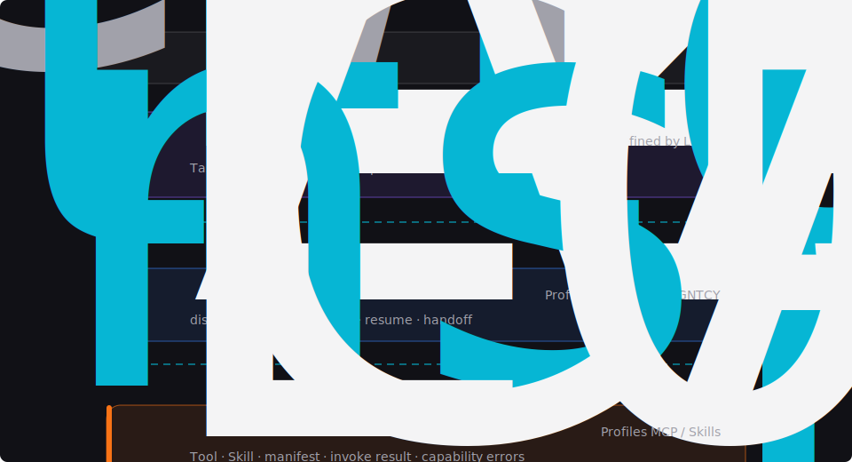

<section class="protocol-brief">
  
Version 0.1.0-draft

  <h2>Loops is not another agent framework. It is a protocol stack for coordination.</h2>
  

    Existing systems already define important parts of the AI stack: tools, skills,
    and agent-to-agent delegation. Loops gives those pieces a stable layered model
    and adds the missing top layer for human-agent work.
  

</section>

<section class="stack-diagram" aria-label="Loops three-layer protocol stack">
  
  
Three layers, four contracts. HACP is newly defined by Loops; AAP and CAP profile protocols that already exist.

</section>

<section class="route-cards" aria-label="Primary reading routes">
  <a class="route-card" href="./overview">
    <strong>Understand the model</strong>
    Read the protocol positioning, design principles, and layer responsibilities.
  </a>
  <a class="route-card" href="./protocol-map">
    <strong>Map the stack</strong>
    See ownership, operations, identity, and contract boundaries in one place.
  </a>
  <a class="route-card" href="./reading-routes">
    <strong>Start implementing</strong>
    Choose the right path for capability providers, agent runtimes, or platforms.
  </a>
  <a class="route-card" href="./conformance">
    <strong>Check compatibility</strong>
    Validate CAP, AAP, HACP, and full-stack conformance claims.
  </a>
</section>

<section class="layer-cards" aria-label="Protocol layers">
  <a class="layer-card l2" href="./specs/hacp">
    L2
    <h3>HACP</h3>
    
Defines how people assign, gate, review, and govern work performed by autonomous agents.

  </a>
  <a class="layer-card l1" href="./specs/aap">
    L1
    <h3>AAP</h3>
    
Defines the minimum conformance profile for agent discovery, delegation, blocking, and handoff.

  </a>
  <a class="layer-card l0" href="./specs/cap">
    L0
    <h3>CAP</h3>
    
Defines the capability interface that lets agents invoke tools and packaged skills without transport leakage.

  </a>
</section>

<section class="protocol-grid">
  <article>
    <h2>What Loops standardizes</h2>
    <ul>
      <li>Human-agent work units with stable task identity.</li>
      <li>Decision checkpoints that pause agent work until a human resolves them.</li>
      <li>Reviewable artifacts with immutable versions and provenance.</li>
      <li>Audit trails that can replay every protocol operation.</li>
      <li>Layer contracts that keep implementation details from crossing boundaries.</li>
    </ul>
  </article>
  <article>
    <h2>What Loops does not replace</h2>
    <ul>
      <li>MCP servers and Skills runtimes remain the natural L0 implementations.</li>
      <li>A2A, ACP, and agent meshes remain natural L1 implementations.</li>
      <li>Host platforms still choose transport, persistence, identity, RBAC, and UI.</li>
      <li>Agent runtimes remain free to choose models, prompts, tools, and execution loops.</li>
    </ul>
  </article>
</section>

<section class="adoption-strip">
  <h2>Adopt one layer at a time</h2>
  

    Capability providers can start with CAP. Agent runtimes can expose the AAP
    profile. Platforms that need accountable human-agent collaboration can implement
    HACP directly and bridge downward through the explicit contracts.
  

  
<a href="./protocol-map">Use the protocol map</a> or <a href="./conformance">view conformance requirements</a>.

</section>
