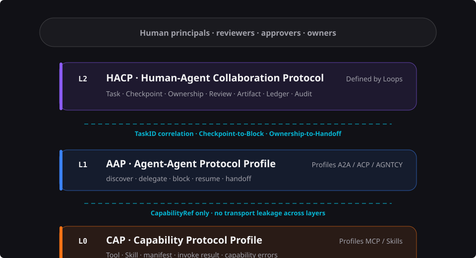

<section class="protocol-brief">
  

    
Version 0.2.0-draft

    <h2>The missing protocol surface is not tools or agents. It is accountability.</h2>
    

      HLP defines how a human principal delegates bounded work to autonomous
      agent harnesses, pauses execution for decisions, reviews artifacts, and
      replays the entire lifecycle through audit.
    

  

  

    

      <strong>Defines</strong>
      Task ownership, checkpoints, reviews, artifacts, ledger, audit
    

    

      <strong>Routes to</strong>
      Existing harnesses, A2A, ACP, AGNTCY, MCP, Agent Skills, local tools
    

    

      <strong>Does not replace</strong>
      Agent harnesses, tool protocols, transports, RBAC, UI channels
    

  

</section>

<section class="route-cards" aria-label="Primary reading routes">
  <a class="route-card" href="./overview">
    <strong>Understand HLP</strong>
    Read the positioning, object model, and why human-loop work needs its own protocol.
  </a>
  <a class="route-card" href="./specs/hlp">
    <strong>Implement HLP</strong>
    Use the complete HLP specification for tasks, checkpoints, reviews, artifacts, ledger, and audit.
  </a>
  <a class="route-card" href="./specs/contracts">
    <strong>Wrap harnesses</strong>
    Map HLP task identity, checkpoints, and harness events into existing harnesses.
  </a>
  <a class="route-card" href="./reading-routes">
    <strong>Use the SDK</strong>
    Start from the HLP host, then wire the harness adapters your platform already uses.
  </a>
</section>

<section class="object-strip" aria-label="HLP first-class objects">
  Task
  Checkpoint
  Ownership
  Review
  Artifact
  Ledger
  Audit
</section>

<section class="stack-diagram" aria-label="HLP integration stack">
  

    
Integration model

    <h2>HLP owns human interaction semantics. Existing harnesses keep execution.</h2>
  

  
  
L1 and L0 pages are integration routes. They explain how HLP preserves task identity, checkpoint control, harness event projection, and capability provenance without defining another agent or tool protocol.

</section>

<section class="layer-cards" aria-label="Protocol layers">
  <a class="layer-card l2" href="./specs/hlp">
    L2
    <h3>HLP</h3>
    
The only full protocol defined by this project: human-owned tasks, checkpoints, reviews, artifacts, ledger, and audit.

  </a>
  <a class="layer-card l1" href="./specs/aap">
    L1
    <h3>Agent routes</h3>
    
Introductory routing guidance for A2A, AGNTCY-style meshes, ACP-style brokers, and existing agent harnesses.

  </a>
  <a class="layer-card l0" href="./specs/cap">
    L0
    <h3>Capability routes</h3>
    
Introductory routing guidance for MCP, Agent Skills, local tools, and function-calling registries.

  </a>
</section>

<section class="protocol-grid">
  <article>
    <h2>What HLP standardizes</h2>
    <ul>
      <li>Human-agent work units with stable task identity.</li>
      <li>Decision checkpoints that pause agent work until a human resolves them.</li>
      <li>Reviewable artifacts with immutable versions and provenance.</li>
      <li>Audit trails that can replay every protocol operation.</li>
      <li>Harness adapter contracts that keep implementation details from crossing boundaries.</li>
    </ul>
  </article>
  <article>
    <h2>What HLP does not replace</h2>
    <ul>
      <li>MCP servers and Skills runtimes remain the natural L0 implementations.</li>
      <li>A2A, ACP, and agent meshes remain natural L1 implementations.</li>
      <li>Host platforms still choose transport, persistence, identity, RBAC, and UI.</li>
      <li>Agent harnesses remain free to choose models, prompts, tools, memory, and execution loops.</li>
    </ul>
  </article>
</section>

<section class="sdk-strip" aria-label="HLP SDK surface">
  

    
SDK surface

    <h2>Applications embed HLP as an SDK, not as an execution harness.</h2>
  

  

    

      <strong>Public entry point</strong>
      <code>loops</code> and <code>loops.hlp</code> expose HLP protocol objects, <code>HLPClient</code>, <code>HLPHost</code>, stores, events, and adapters.
    

    

      <strong>Runtime boundary</strong>
      <code>AgentAdapter</code> controls external harnesses; <code>HarnessAdapter</code> projects their human-facing events into HLP.
    

    

      <strong>SDK boundary</strong>
      Loops does not ship a built-in agent harness. Execution belongs to the harness you wrap.
    

  

  

    from loops import ArtifactPayload, CheckpointOption
    from loops import CodexCLIAdapter, HLPHost
    
    host = HLPHost.in_memory(adapter=CodexCLIAdapter())
    client = host.client
    
    task = await client.create_task(
        principal="user_alice",
        goal="Review PR #1234",
    )
    run = await client.delegate(task.id, "agent_codex")
    await client.start(task.id)
    
    checkpoint = await client.raise_checkpoint(
        task_id=task.id,
        kind="choice",
        prompt="Ship the patch?",
        options=(CheckpointOption(id="safe", label="Review first"),),
        raised_by=run.agent_id,
    )
    await client.resolve_checkpoint(
        checkpoint.id, by="user_alice", action="choose", choice="safe"
    )
    
    artifact = await client.commit_artifact(
        task_id=task.id, type="report",
        payload=ArtifactPayload(
            kind="inline", uri="mem://report-v1", checksum="sha256:report-v1"
        ),
        produced_by=run.agent_id,
    )
    review = await client.submit_review(
        task_id=task.id, artifact_id=artifact.id,
        reviewer="user_alice", verdict="approved",
    )
    await client.write_ledger("project:web", "pr.1234", review.verdict, by=task.id)
    audit = await client.replay_audit(task.id)
  

</section>

<section class="sdk-strip" aria-label="First-class CLI harness adapters">
  

    
First-class adapters

    <h2>Four agent CLIs share one harness projection pipeline.</h2>
    
Codex, Pi, Claude Code, and Kimi wrap into HLP with the same JSONL projection of human-loop events, reliable peek/ack event delivery, and chat/protocol prompt modes — covered by offline contract suites and an opt-in live four-CLI lifecycle E2E.

  

  <table>
    <thead>
      <tr><th>CLI</th><th>Delegate adapter</th><th>Harness adapter (projection + peek/ack)</th><th>Wire mode</th></tr>
    </thead>
    <tbody>
      <tr><td>Codex</td><td><code>CodexCLIAdapter</code></td><td><code>CodexHarnessAdapter</code></td><td><code>codex exec --json</code></td></tr>
      <tr><td>Pi</td><td>—</td><td><code>PiHarnessAdapter</code></td><td><code>pi --mode json</code></td></tr>
      <tr><td>Claude Code</td><td><code>ClaudeCodeCLIAdapter</code></td><td><code>ClaudeCodeHarnessAdapter</code></td><td><code>claude -p --output-format stream-json</code></td></tr>
      <tr><td>Kimi</td><td><code>KimiCLIAdapter</code></td><td><code>KimiHarnessAdapter</code></td><td><code>kimi -p --output-format stream-json</code></td></tr>
    </tbody>
  </table>
  
Sensor input such as brain-computer interfaces (BCI) is compatible by design (spec appendix C): a decoder is only a channel-plane producer of <code>ControlSignal</code> values, high-risk checkpoints cannot close on BCI alone (fail-closed, second factor supported), and the offline <code>loops-hlp-bci-demo</code> proves it — zero protocol changes.

</section>

<section class="contract-band" aria-label="Integration contracts">
  

    
Boundary rules

    <h2>Four contracts keep the stack replaceable.</h2>
  

  

    <a href="./specs/contracts#contract-1-external-evidence-reference">
      <strong>External evidence</strong>
      Capability evidence is optional, opaque, and never transport.
    </a>
    <a href="./specs/contracts#contract-2-taskid-correlation">
      <strong>TaskID correlation</strong>
      The HLP task id survives every delegated agent run.
    </a>
    <a href="./specs/contracts#contract-3-checkpoint-to-block">
      <strong>Checkpoint to block</strong>
      Human decisions pause and resume the corresponding run.
    </a>
    <a href="./specs/contracts#contract-4-harness-event-projection">
      <strong>Harness event projection</strong>
      Approval, input, and artifact events become HLP objects.
    </a>
    <a href="./specs/contracts#contract-5-ownership-to-handoff">
      <strong>Ownership to handoff</strong>
      Responsibility changes preserve execution correlation.
    </a>
  

</section>

<section class="adoption-strip">
  <h2>Start with the human loop</h2>
  

    Platforms that need accountable harness-backed human-agent work should embed HLP
    directly. Agent harnesses and capability providers stay on their existing
    protocols; HLP only requires narrow adapter contracts at the boundary.
  

  
<a href="./specs/hlp">Read the HLP spec</a> or <a href="./protocol-map">view the integration map</a>.

</section>
